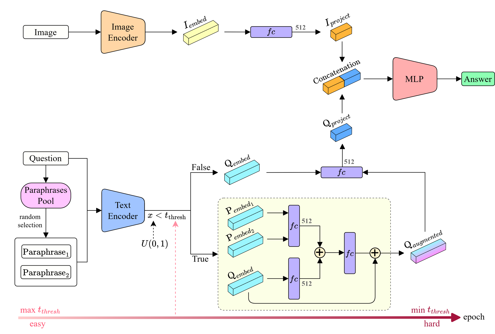

# Enhancing Vietnamese VQA through Curriculum Learning on Raw and Augmented Text Representations

## Description

We present a novel framework for Vietnamese Visual Question Answering (VQA), focusing on addressing linguistic diversity and resource constraints inherent to low-resource languages. Our method integrates **curriculum learning** and **paraphrase-based feature augmentation**, enabling progressive adaptation from easier (augmented) to harder (raw) textual representations.

The proposed framework incorporates:

1. A lightweight **two-tower architecture** leveraging pre-trained Vietnamese models for text encoding and CNNs for image processing.
2. **Feature augmentation** using paraphrased question embeddings to enrich training datasets, enhancing linguistic robustness.
3. A dynamic **curriculum learning strategy** that systematically transitions training difficulty to improve generalization.





## Installation


### 1. Packages

```bash
conda create -n vqa_env -y python=3.12
conda activate vqa_env
pip install -r requirements.txt
```


### 2. Download datasets

```bash
cd dataset
python download.py
```


## How to Run

### Using bash script

To simplify training, please execute the training script using the provided ```start_training.sh``` file:

```bash
start_training.sh
```
This script sets up the training with the following key configurations:

* Dataset: OpenViVQA
* Epochs: 40
* Patience: 5
* Text augmentation: Enabled (2 paraphrases per question, with a threshold of 0.8).
* Dynamic curriculum learning: Enabled (threshold transitions from 0.8 to 0.4).

To modify the training parameters, please edit ```start_training.sh```. For running specific configurations manually from terminal, please use the following scripts.
## Scripts
```bash
python3 train.py --seed 59 --dataset_name openvivqa --is_text_augment True --n_text_paras 2 --n_text_para_pool 10 --text_para_thresh 0.8 --use_dynamic_thresh True
--is_img_augment False
```

## Benchmarks

### Vietnamese VQA

| Dataset   | Description                            | Size                           |
|-----------|----------------------------------------|--------------------------------|
| ViVQA     | Vietnamese Visual Question Answering   | 10,328 images, 15,000 QA pairs |
| OpenViVQA | Open-domain VQA in Vietnamese          | 11,199 images, 37,914 QA pairs |

## Citation
If this work contributes to your research or project, please cite the following paper:

```bash
```
